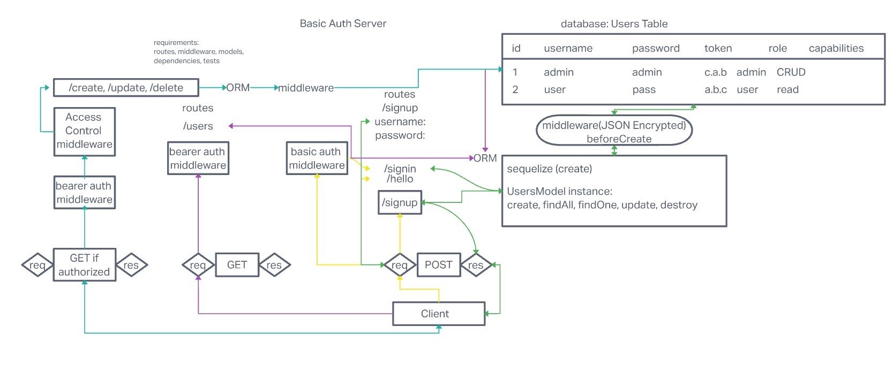

# Auth-api Lab 09

## Author: Alan Chelko

### Problem Domain

* Create a new application using API Server and Authentication System

### Setup

* Port: 3001

### Deployed server

[chelko-auth-api-prod](https://chelko-auth-api-prod.herokuapp.com/)

### Requirements

* API/Auth server must be deployed
* Use of API server to perform database operations
* Use of login/auth/acl to control access to  resources

### Running the app

* npm start

### UML: Auth-api -- Lab 08

