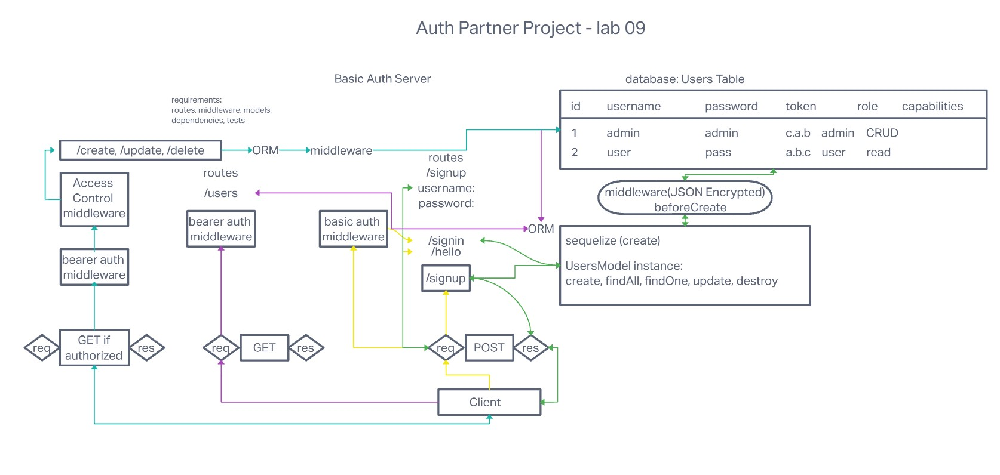

# Code 401d48 lab 09

## Author: Alan Chelko

### Problem Domain

* Create a new application using API Server and Authentication System

### Deployed server

[chelko-auth-api-prod](https://herokuapp.com/chelko-auth-api-prod)

Requirements:

* API/Auth server must be deployed
* Use of API server to perform database operations
* Use of login/auth/acl to control access to  resources

Documentation:

